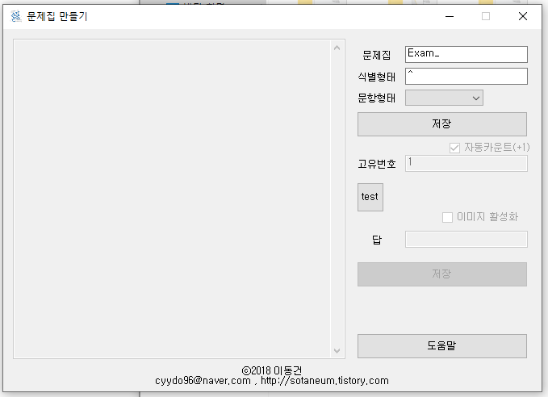
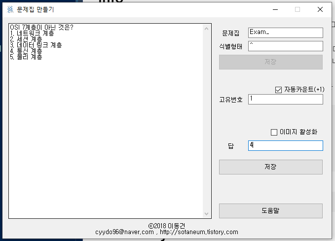

# Question-Bank-Teacher

Question Bank Teacher :: 문제은행에서 문제를 만드는 프로그램입니다.



## Download

- 0.0.2 (`2018.01.18.2000`)
  - [Windows x86 zip file](./build/Question-Bank-Teacher_x86_0.0.2.zip?raw=true)

## Old Version

- [0.0.1 (`2018.01.18.1254`)](https://github.com/Sotaneum/Question-Bank-Teacher/tree/33bdfa6a8836dc73c181dfc0973db85efdc7e9ba)

## Info

- `문제를 풀어보기 위한 문제`를 만드는 프로그램입니다. 이 프로그램은 `문제은행(Question-Bank)` 프로젝트의 일부입니다.
- `Question-Bank`프로젝트의 [`Question-Bank-Student`](https://github.com/Sotaneum/Question-Bank-Student)와 호환됩니다.
- 문제집 생성
  - `문제집`란에 `문제집 이름`을 지정합니다.
  - `식별형태`란에 `문제나 문항에 들어가지 않는 문자열`을 넣습니다.
  - `문항형태` 체크박스을 눌러 문항의 번호 방식을 선택합니다.
  - `저장` 버튼을 눌러 문제집을 생성합니다.
- 문제 등록
  - 좌측 빈 공간에 문제를 아래와 같이 `작성`합니다.

    
  
    ```text
    OSI 7계층이 아닌 것은?
    1. 네트워크 계층
    2. 세션 계층
    3. 데이터 링크 계층
    4. 통신 계층
    5. 물리 계층
    ```

  - 우측 `고유번호` 칸은 특별한 경우를 아니고서는 그대로 놔둡니다.
  - 우측 `답` 칸은 `문항형태`를 기준으로 답을 입력합니다.
    - `문항형태`가 `A`일 경우

        ```text
        D
        ```

    - `문항형태`가 `1`일 경우

        ```text
        4
        ```

  - `저장`버튼을 누르면 문제가 문제집에 저장됩니다.

## What did you learn

- VB.NET 기반 언어를 `입출력`에 대해 공부할 수 있었습니다.
- 문제가 어떻게 생겼는 지에 대해 판단하고 어떻게 하면 `맞았다/틀렸다`를 구분할 수 있는지 알 수 고민하는 시간을 가졌습니다.
- `문자열 처리`에 대해 공부할 수 있었습니다.

## Finally

- CCNA, OCP, OCJP를 공부할 때 문제집을 사용하기 보다 문제은행을 만들면 어떨까에 대한 생각에서 시작했습니다.
- 어떻게 하면 쉽게 문제를 등록할 수 있을지에 대해 고민했습니다.
- 사진이 필요한 문제에 대해서는 어떻게 처리할 지 고민을 했습니다.

## Modify Content

- 2018.01.18.2000
  1. 엔터처리 안해됨
  2. \n입력되도록 처리
  3. vbli 오류 해결
  4. 항목이 A든, 1로 시작하든 사용자가 선택하면 알아서 인식해서 처리

- 2018.01.18.1254
  - 구현

## Copyright

- 비상업적 용도로 사용 가능하며 링크를 반드시 포함해주세요.
- 문제가 되는 내용이 있다면 언제든지 [`issue`](https://github.com/Sotaneum/Question-Bank-Teacher/issues/new), [`Pull requests`](https://github.com/Sotaneum/Question-Bank-Teacher/compare) 부탁드립니다.
