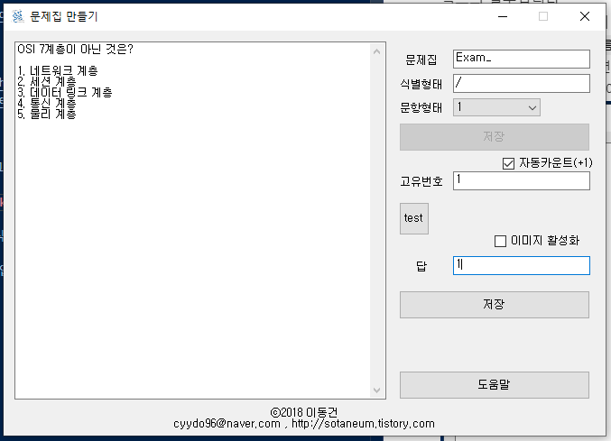

# Question-Bank-Teacher

Question Bank Teacher :: 문제은행에서 문제를 만드는 프로그램입니다.


## Download

- 0.0.1 (`2018.01.18.1254`)
  - [Windows x86 zip file](./build/Question-Bank-Teacher_x86_0.0.1.zip?raw=true)

## Info

- `문제를 풀어보기 위한 문제`를 만드는 프로그램입니다. 이 프로그램은 `문제은행(Question-Bank)` 프로젝트의 일부입니다.
- `Question-Bank`프로젝트의 [`Question-Bank-Student`](https://github.com/Sotaneum/Question-Bank-Student)와 호환됩니다.
- 문제집 생성 : `문제집의 이름`을 지정하고 식별형태(문제 문항이나 답에 해당 정보가 없을 문자열)를 입력 후 저장버튼을 누르면 됩니다.
- 문제 등록 : 좌측의 빈공간에 문제와 번호를 입력합니다. 문항은 다음과 같은 규칙이 있습니다.

    

  - 좌측 공간에 아래와 같이 `입력`합니다.
  
    ```text
    OSI 7계층이 아닌 것은?
    1. 네트워크 계층
    2. 세션 계층
    3. 데이터 링크 계층
    4. 통신 계층
    5. 물리 계층
    ```

  - 우측의 답에는 아래와 같이 `기입`합니다.

    ```text
    D
    ```

  - `저장버튼`을 누르면 문제가 문제집에 저장됩니다.

## What did you learn

- VB.NET 기반 언어를 `입출력`에 대해 공부할 수 있었습니다.
- 문제가 어떻게 생겼는 지에 대해 판단하고 어떻게 하면 `맞았다/틀렸다`를 구분할 수 있는지 알 수 고민하는 시간을 가졌습니다.
- `문자열 처리`에 대해 공부할 수 있었습니다.

## Finally

- CCNA, OCP, OCJP를 공부할 때 문제집을 사용하기 보다 문제은행을 만들면 어떨까에 대한 생각에서 시작했습니다.
- 어떻게 하면 쉽게 문제를 등록할 수 있을지에 대해 고민했습니다.
- 사진이 필요한 문제에 대해서는 어떻게 처리할 지 고민을 했습니다.

## Modify Content

- 2018.01.18.1254
  - 구현

## Copyright

- 비상업적 용도로 사용 가능하며 링크를 반드시 포함해주세요.
- 문제가 되는 내용이 있다면 언제든지 [`issue`](https://github.com/Sotaneum/Question-Bank-Teacher/issues/new), [`Pull requests`](https://github.com/Sotaneum/Question-Bank-Teacher/compare) 부탁드립니다.
